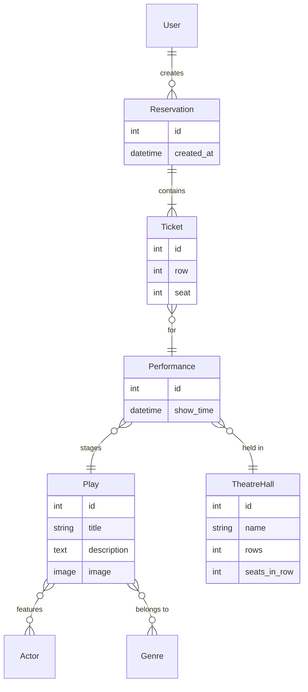

# 🎭 Theatre API

RESTful API for a theatre booking service — browse plays, check performance schedules, and reserve tickets online.

## Overview

Theatre API is a Django REST Framework application that models a full theatre workflow: managing plays with actors and genres, configuring theatre halls, scheduling performances, and handling ticket reservations with seat validation. The API features JWT authentication, query filtering, annotated availability data, image uploads, and auto-generated Swagger documentation.

## Tech Stack

- **Backend:** Python 3.11, Django, Django REST Framework
- **Database:** PostgreSQL 16
- **Auth:** JWT (simplejwt)
- **Docs:** drf-spectacular (Swagger / Redoc)
- **Containerization:** Docker, Docker Compose
- **Other:** Pillow (image uploads), flake8 (linting)

## Features

- Full CRUD for **Plays**, **Actors**, **Genres**, **Theatre Halls**, **Performances**, **Reservations**
- Play filtering by **title**, **actors**, **genres**; Performance filtering by **play** and **date**
- Annotated `tickets_available` field on performances (capacity minus sold tickets)
- Seat/row validation against theatre hall dimensions (reusable `validate_ticket` method)
- Image upload endpoint for plays (`POST /api/theatre/plays/{id}/upload-image/`)
- Nested ticket creation within reservations using `transaction.atomic()`
- Optimized queries with `select_related` and `prefetch_related`
- Swagger & Redoc documentation at `/api/schema/swagger-ui/`
- Custom user model with email-based authentication
- Non-root Docker user with dedicated media volume

## DB Schema



## API Endpoints

| Resource | Endpoint | Methods |
|----------|----------|---------|
| Actors | `/api/theatre/actors/` | GET, POST, PUT, PATCH, DELETE |
| Genres | `/api/theatre/genres/` | GET, POST, PUT, PATCH, DELETE |
| Theatre Halls | `/api/theatre/halls/` | GET, POST, PUT, PATCH, DELETE |
| Plays | `/api/theatre/plays/` | GET, POST, PUT, PATCH, DELETE |
| Play image | `/api/theatre/plays/{id}/upload-image/` | POST |
| Performances | `/api/theatre/performances/` | GET, POST, PUT, PATCH, DELETE |
| Reservations | `/api/theatre/reservations/` | GET, POST |
| Register | `/api/user/register/` | POST |
| Login (JWT) | `/api/user/login/` | POST |
| Token refresh | `/api/user/token/refresh/` | POST |
| My profile | `/api/user/me/` | GET, PUT, PATCH |
| Swagger docs | `/api/schema/swagger-ui/` | GET |

## Getting Started

### Prerequisites

- Docker & Docker Compose **or** Python 3.11+ and PostgreSQL

### Run with Docker (recommended)

```bash
git clone https://github.com/onyevyerov/theatre_api.git
cd theatre_api
cp .env.sample .env   # edit with your credentials
docker-compose build
docker-compose up
```

### The API will be available at http://localhost:8001/api/.

The API will be available at `http://localhost:8001/api/`.

### Run locally

```bash
git clone https://github.com/onyevyerov/theatre_api.git
cd theatre_api
python -m venv venv
source venv/bin/activate        # Linux/macOS
# venv\Scripts\activate         # Windows

pip install -r requirements.txt

# Set environment variables (or create .env file)
export DB_HOST=localhost
export DB_NAME=theatre
export DB_USER=postgres
export DB_PASSWORD=yourpassword
export SECRET_KEY=your-secret-key

python manage.py migrate
python manage.py runserver
```

### Create admin user

```bash
python manage.py createsuperuser
```

## .env.sample

```
POSTGRES_HOST=db
POSTGRES_DB=theatre
POSTGRES_USER=theatre
POSTGRES_PASSWORD=theatre
PGDATA=/var/lib/postgresql/data
SECRET_KEY=<PUT_YOUR_SECRET_KEY_HERE>

```
